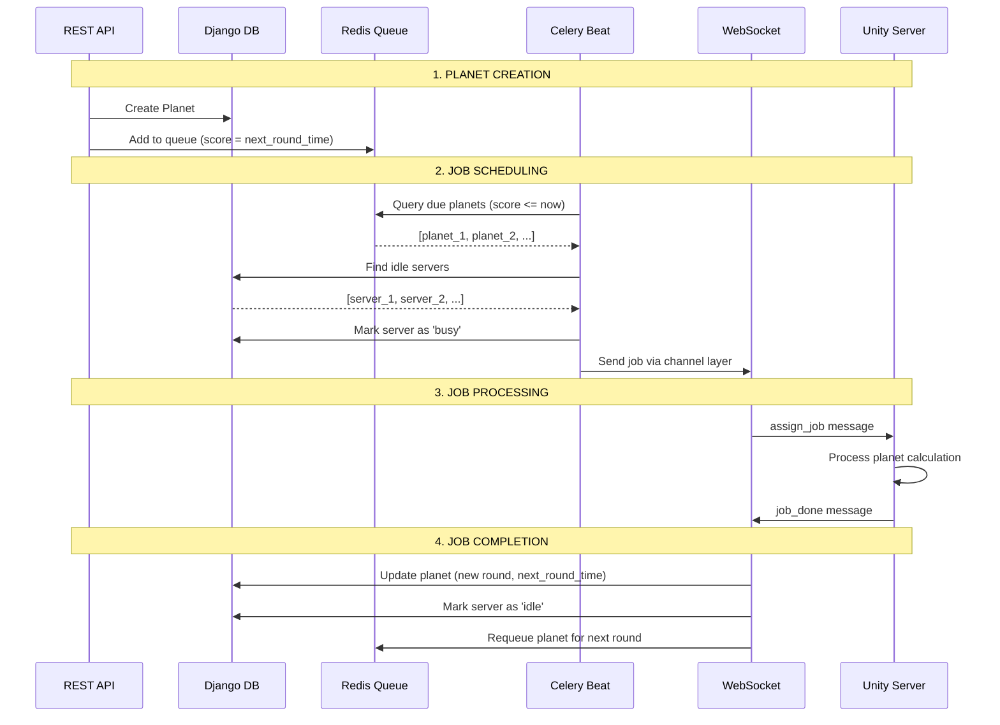

# Django Unity Server Orchestrator - Codebase Analysis

## Executive Summary

This is a **distributed game server orchestration system** that coordinates multiple Unity game servers to process planet calculations. Django acts as the central orchestrator, using WebSockets for real-time communication and Redis for job scheduling.

---

## System Architecture

```
┌─────────────────────────────────────────────────────────────────────────────┐
│                              BACKEND (Django)                                │
├─────────────────────────────────────────────────────────────────────────────┤
│  ┌──────────────┐    ┌──────────────┐    ┌──────────────────────────────┐  │
│  │   REST API   │    │  Dashboard   │    │     WebSocket Server         │  │
│  │   (views)    │    │   (HTML)     │    │      (consumers)             │  │
│  └──────┬───────┘    └──────────────┘    └───────────────┬──────────────┘  │
│         │                                                 │                 │
│         ▼                                                 ▼                 │
│  ┌──────────────────────────────────────────────────────────────────────┐  │
│  │                    Assignment Service                                 │  │
│  │                 (matches planets to servers)                          │  │
│  └─────────────────────────────┬────────────────────────────────────────┘  │
│                                │                                            │
│         ┌──────────────────────┼──────────────────────┐                    │
│         ▼                      ▼                      ▼                    │
│  ┌─────────────┐    ┌──────────────────┐    ┌──────────────────┐          │
│  │   Models    │    │   Celery Tasks   │    │   Redis Queue    │          │
│  │  (Django)   │    │  (Async Workers) │    │  (Sorted Set)    │          │
│  └─────────────┘    └──────────────────┘    └──────────────────┘          │
└─────────────────────────────────────────────────────────────────────────────┘
                    │ WebSocket │              │ HTTP │
                    └─────┬─────┘              └──┬───┘
                          │                       │
                          ▼                       ▼
┌─────────────────────────────────────────────────────────────────────────────┐
│                         UNITY GAME SERVERS                                   │
│  ┌─────────────────┐  ┌─────────────────┐  ┌─────────────────┐              │
│  │  Unity Server 1  │  │  Unity Server 2  │  │  Unity Server N  │           │
│  │  (Game Engine)   │  │  (Game Engine)   │  │  (Game Engine)   │           │
│  └─────────────────┘  └─────────────────┘  └─────────────────┘              │
└─────────────────────────────────────────────────────────────────────────────┘
```

---

## Data Flow

### Complete Job Lifecycle



---

## Core Components

### 1. Models (`models.py`)

| Model | Purpose | Key Fields |
|-------|---------|------------|
| **UnityServer** | Tracks connected Unity game servers | `server_id`, `status`, `last_heartbeat`, `current_task` |
| **Planet** | Game worlds requiring periodic calculations | `planet_id`, `next_round_time`, `status`, `error_retry_count` |
| **TaskHistory** | Audit log of all job executions | `planet`, `server`, `status`, `duration_seconds`, `error_message` |

**State Machines:**

```
UnityServer: offline → idle → busy → idle
                           ↓
                       offline (disconnect)

Planet: queued → processing → queued (success)
                          ↓
                       error (max retries)
```

---

### 2. Redis Queue (`redis_queue.py`)

Uses Redis **Sorted Set** for efficient time-based scheduling:

```
Key: planet_round_queue
Member: planet_id       Score: unix_timestamp (next_round_time)
────────────────────    ────────────────────────────────────────
"79001"                 1703289600.0  (Dec 22, 10:00 AM)
"79002"                 1703289660.0  (Dec 22, 10:01 AM)
```

**Operations:**
- `ZADD`: Add/update planet with scheduled time
- `ZRANGEBYSCORE 0 <now>`: Get due planets
- `ZREM`: Remove after assignment

---

### 3. Assignment Service (`assignment_service.py`)

The "brain" that matches planets to servers:

```python
def assign_available_planets():
    1. Get due planets from Redis (or fallback to DB)
    2. Get idle servers (ordered by load)
    3. For each (planet, server) pair:
       a. Mark server BUSY immediately (prevent race condition)
       b. Dispatch Celery task
       c. Remove planet from Redis queue
```

**Load Balancing:** Servers ordered by `total_completed_planet` (ascending) so least-loaded servers get work first.

---

### 4. Celery Tasks (`tasks.py`)

| Task | Purpose | Trigger |
|------|---------|---------|
| `process_due_planets` | Main scheduler loop | Celery Beat (every 5s) |
| `assign_job_to_server` | Dispatch job via WebSocket | Assignment service |
| `handle_job_completion` | Process success from Unity | WebSocket message |
| `handle_job_error` | Handle failures with retry | WebSocket message |
| `handle_job_skipped` | Requeue when round time not expired | WebSocket message |
| `check_server_health` | Detect stale servers | Celery Beat (every 5s) |

**Error Handling:**
- Max 5 retries with **exponential backoff** (1s, 2s, 4s, 8s, 16s)
- Respects `next_round_time` - uses whichever is later (backoff or scheduled time)
- Single TaskHistory record reused across retries
- After max retries: auto-resets and waits 30 seconds

---

### 5. WebSocket Consumer (`consumers.py`)

Handles real-time bidirectional communication:

**Unity → Django:**
| Message | Purpose |
|---------|---------|
| `heartbeat` | "I'm alive" + CPU/RAM metrics |
| `status_update` | "I'm idle/busy" |
| `job_done` | "Finished planet X, next round at Y" |
| `job_skipped` | "Round time not expired, requeue for Y" |
| `error` | "Failed to process planet X" |

**Django → Unity:**
| Message | Purpose |
|---------|---------|
| `assign_job` | "Process planet X" |
| `command` | "restart", "stop", etc. |
| `pong` | Heartbeat acknowledgment |

---

### 6. REST API (`views.py`)

| Endpoint | Method | Purpose |
|----------|--------|---------|
| `/api/planet/<id>/` | GET | Get planet data |
| `/api/planet/create/` | POST | Create new planet |
| `/api/planet/remove/<id>/` | DELETE | Remove planet |
| `/api/result/` | POST | Submit job result (HTTP fallback) |
| `/api/servers/` | GET | List all servers |
| `/api/queue/` | GET | Queue statistics |
| `/api/force-assign/` | POST | Manually trigger assignment |
| `/api/command/` | POST | Send command to server |

---

### 7. Unity Client (`UnityWebSocketClient.cs`)

C# WebSocket client that:

1. **Connects** to Django with auto-generated server ID (`unity_{IP}`)
2. **Sends heartbeats** every 5 seconds with system metrics
3. **Receives jobs** and processes planets via `PinoWorldManager`
4. **Reports results** back via `job_done` or `error` messages
5. **Auto-reconnects** on disconnect with exponential backoff

---

## Key Design Decisions

### 1. Single TaskHistory Per Job Attempt
**Problem:** Rapid retries created 173 records in 4 seconds
**Solution:** Retry attempts reuse existing failed record instead of creating new ones

### 2. Immediate Retry (No Backoff)
**Rationale:** Errors are often transient; with single TaskHistory, no DB bloat from retries, max 5 retry limit prevents loops

### 3. Event-Driven Assignment
**Optimization:** Jobs assigned immediately when server becomes idle (WebSocket event) rather than waiting for next scheduler tick

### 4. Redis as Scheduling Cache
**Design:** Redis queue is secondary to Django DB (source of truth). Self-healing recovery if Redis data is lost

### 5. Race Condition Prevention
**Critical:** Server marked `busy` synchronously BEFORE Celery task dispatch to prevent double-assignment

---

## Technology Stack

| Component | Technology |
|-----------|------------|
| Backend Framework | Django 4.x |
| Async Framework | Django Channels |
| Task Queue | Celery + Redis |
| Scheduling Queue | Redis Sorted Sets |
| WebSocket | Django Channels (Daphne) |
| Database | SQLite (dev) / PostgreSQL (prod) |
| Unity Integration | WebSocketSharp + Newtonsoft.Json |

---

## File Structure

```
django-socket-with-unity/
├── game_manager/
│   ├── models.py           # Data models (UnityServer, Planet, TaskHistory)
│   ├── views.py            # REST API + Dashboard views
│   ├── consumers.py        # WebSocket handlers
│   ├── tasks.py            # Celery async tasks
│   ├── assignment_service.py  # Job matching logic
│   ├── redis_queue.py      # Redis sorted set operations
│   ├── startup.py          # Server state recovery on restart
│   ├── serializers.py      # DRF serializers
│   ├── routing.py          # WebSocket URL routing
│   ├── urls.py             # HTTP URL routing
│   ├── admin.py            # Django admin config
│   ├── apps.py             # App configuration
│   └── templates/          # Dashboard HTML
│       └── game_manager/
│           ├── dashboard.html
│           └── task_history.html
├── server_orchestrator/    # Django project settings
│   ├── settings.py
│   ├── celery.py
│   ├── asgi.py
│   └── urls.py
├── unity_scripts/          # Unity C# integration
│   └── UnityWebSocketClient.cs
└── requirements.txt
```

---

## Metrics & Monitoring

The dashboard provides real-time visibility into:

- **Server Status:** idle/busy/offline counts, resource metrics
- **Queue Status:** pending planets, next due time
- **Task History:** success/failure rates, average duration
- **Error Tracking:** failed tasks with retry counts

---

## Summary

This system efficiently orchestrates distributed Unity game servers for planet calculations using:

- **WebSockets** for low-latency bidirectional communication
- **Redis** sorted sets for time-based job scheduling
- **Celery** for reliable async task processing
- **Self-healing** recovery from failures (server disconnect, Redis restart)
- **Event-driven** assignment for minimal latency
