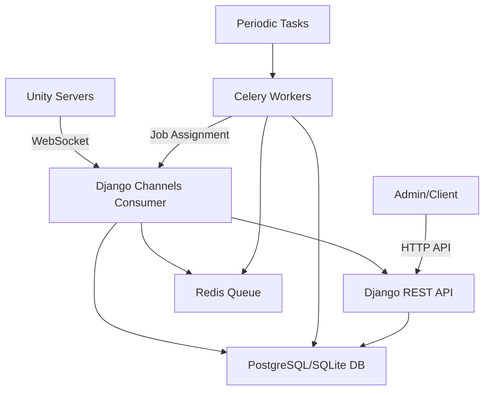

# Django-Unity Server Orchestration System - Project Report

**Generated on:** 2025-12-18  
**Project:** django-socket-with-unity  
**Version:** Post Unity Client Refactor + API Simplification

---

## 📋 Executive Summary

This project implements a **real-time server orchestration system** connecting multiple Unity game servers to a Django backend using **WebSockets** for job distribution and monitoring. The system manages game calculation tasks (planet simulations) across a distributed network of Unity servers with automatic load balancing, failover recovery, and health monitoring.

**Recent Updates:**
- Unity WebSocket client refactored with improved error handling and reconnection logic
- Create Map API simplified to require only `map_id` and `season_id`
- **CRITICAL:** Unity client is missing the `SendJobDone` method and has incorrect server ID format

---

## 🏗️ Architecture Overview

### System Components



### Communication Flow

1. **Unity → Django**: Heartbeats, status updates, job completion
2. **Django → Unity**: Job assignments, administrative commands
3. **Celery**: Background job processing, queue management, health checks
4. **Redis**: Priority queue for pending map calculations

---

## 🛠️ Technology Stack

| Component | Technology | Version | Purpose |
|-----------|-----------|---------|---------|
| **Backend Framework** | Django | 6.0+ | Core web framework |
| **API Framework** | Django REST Framework | 3.16+ | RESTful API endpoints |
| **WebSocket** | Django Channels | 4.3+ | Real-time bidirectional communication |
| **ASGI Server** | Daphne | (via Channels) | WebSocket protocol support |
| **Task Queue** | Celery | 5.6+ | Background job processing |
| **Message Broker** | Redis | 7.1+ | Queue management & WebSocket layers |
| **Production Server** | Gunicorn | 23.0+ | Production WSGI server |
| **Unity Client** | WebSocketSharp + Newtonsoft.Json | - | Unity C# WebSocket client |
| **Database** | SQLite (dev) | - | Development database |

---

## 📊 Data Models

### 1. UnityServer
**Fields:**
- `server_id` (PK) - Unique identifier (e.g., `unity_192_168_1_100`)
- `server_ip` - Server IP address
- `status` - Current state: `offline`, `idle`, `busy`, `not_responding`, `not_initialized`
- `last_heartbeat` - Timestamp of last heartbeat
- Resource metrics: `idle_cpu_usage`, `idle_ram_usage`, `max_cpu_usage`, `max_ram_usage`, `disk_usage`
- Task tracking: `current_task`, `total_assigned_map`, `total_completed_map`, `total_failed_map`
- Connection tracking: `connected_at`, `disconnected_at`

### 2. Planet (Map)
**Fields:**
- `map_id` (PK) - Unique map identifier
- `season_id` - Season identifier
- `round_id` - Current round ID (defaults to 0)
- `current_round_number` - Round counter (defaults to 0)
- `next_round_time` - Scheduled processing time
- `status` - State: `queued`, `processing`, `completed`, `error`
- `last_processed` - Last completion timestamp
- `processing_server` (FK) - Current assigned server

### 3. TaskHistory
**Fields:**
- `map` (FK) - Associated map
- `server` (FK) - Processing server
- `start_time`, `end_time` - Execution timestamps
- `status` - Result: `started`, `completed`, `failed`, `timeout`
- `error_message` - Error details (if failed)
- `duration_seconds` - Processing time

---

## 🔌 API Endpoints

### REST API (`/api/`)

| Method | Endpoint | Purpose | Required Fields |
|--------|----------|---------|-----------------|
| GET | `/map/<map_id>/` | Retrieve map configuration | - |
| POST | `/map/create/` | Create new map | `map_id`, `season_id` |
| POST | `/result/` | Submit job completion | `map_id`, `server_id`, `next_round_time` |
| GET | `/servers/` | List all servers | - |
| GET | `/server/<server_id>/` | Get server details | - |
| GET | `/queue/` | Queue statistics | - |
| POST | `/command/` | Send admin commands | `server_id`, `action` |

### Create Map API (Simplified)

**Endpoint:** `POST /api/map/create/`

**Request:**
```json
{
  "map_id": "planet_123",
  "season_id": 1
}
```

**Response:**
```json
{
  "map_id": "planet_123",
  "season_id": 1,
  "round_id": 0,
  "current_round_number": 0,
  "next_round_time": "2025-12-18T01:50:00Z",
  "status": "queued",
  "last_processed": null,
  "processing_server_id": null
}
```

**Notes:**
- Only `map_id` and `season_id` are required
- `round_id` and `current_round_number` default to 0
- `next_round_time` automatically set to NOW
- Map is immediately added to Redis queue for processing

### WebSocket Endpoint

**URL:** `ws://host/ws/server/<server_id>/`

**Unity → Django Messages:**
- `heartbeat` - Resource metrics (every 5s)
- `status_update` - Status change (idle/busy)
- `job_done` - Job completion with next round time
- `error` - Error reports
- `disconnect` - Graceful disconnect

**Django → Unity Messages:**
- `assign_job` - Job assignment with map details
- `command` - Administrative commands

---

## 🆕 Unity Client Refactoring - Improvements

### ✅ **What's Better**

1. **Automatic Reconnection**
   - Exponential backoff: `5s × attempt_number`, capped at 30s
   - Intelligent disconnect reason tracking
   - Prevents reconnection during shutdown

2. **Thread-Safe Message Handling**
   - Uses `MainThreadDispatcher` for Unity main thread execution
   - Async/await support for job processing

3. **Improved IP Detection**
   - Fallback between multiple services
   - 5-second timeout per service
   - Graceful degradation to "unknown"

4. **Better Error Handling**
   - Try-catch in job processing with auto error reporting
   - Exception logging

5. **Cleaner Code**
   - Well-organized sections
   - Simplified message sending
   - Better naming

---

## 🚨 **CRITICAL ISSUES - Unity Client**

**Total Critical Issues:** 2

### ❌ **Issue #1: Missing SendJobDone Method**

**Severity:** CRITICAL  
**Impact:** Job completions CANNOT be reported

**Required Fix:**
```csharp
// Add to UnityWebSocketClient.cs in "OUTGOING MESSAGES" section (around line 307)

public void SendJobDone(string mapId, DateTime nextRoundTime)
{
    if (ws == null || !ws.IsAlive) return;

    ws.Send(new JObject
    {
        ["type"] = "job_done",
        ["map_id"] = mapId,  // ✅ Correct field name
        ["next_round_time"] = nextRoundTime.ToString("O")  // ✅ ISO 8601
    }.ToString());
    
    Debug.Log($"[Job Done] ✅ Sent for {mapId}, next: {nextRoundTime:O}");
    
    SendStatusUpdate("idle");  // Mark server idle for new jobs
}
```

---

### ❌ **Issue #2: Wrong Server ID Format**

**Location:** Line 62 in `UnityWebSocketClient.cs`

**Current (Wrong):**
```csharp
serverId = publicIP.Replace(".", "_");  // Generates: 192_168_1_100
```

**Fixed:**
```csharp
serverId = $"unity_{publicIP.Replace(".", "_")}";  // Generates: unity_192_168_1_100
```

---

## 🔄 System Workflow

1. **Map Creation** via `POST /api/map/create/` with just `map_id` and `season_id`
2. **Auto-Queueing** - Map added to Redis with `next_round_time=NOW`
3. **Unity Connection** - Server connects and registers as `idle`
4. **Job Assignment** - Assignment service matches due maps to idle servers
5. **Job Processing** - Unity processes the job
6. **⚠️ BROKEN:** Unity should call `SendJobDone()` but method is missing
7. **Completion Handler** - Would update map, free server, re-queue for next round

---

## ✅ What Works

- ✅ Server connection and registration
- ✅ Automatic reconnection with exponential backoff
- ✅ IP detection with fallback
- ✅ Heartbeat transmission (every 5s)
- ✅ Job reception and parsing
- ✅ Status updates (idle/busy)
- ✅ Error reporting
- ✅ Graceful disconnect
- ✅ Simplified map creation API

---

## ❌ What's Broken

- ❌ Job completion reporting (missing `SendJobDone`)
- ❌ Server ID format (missing "unity_" prefix)
- ❌ Round progression (can't complete jobs)
- ❌ Server release (stays busy forever)

---

## 🔧 Implementation Checklist

### Critical (Must Fix)
- [ ] Add `SendJobDone(string mapId, DateTime nextRoundTime)` method
- [ ] Fix server ID format: line 62 in `UnityWebSocketClient.cs`

### Optional Improvements
- [ ] Update `SendFailed` to use `map_id` instead of `planet_id`
- [ ] Add job timeout detection
- [ ] Implement job progress reporting
- [ ] Add automated tests

---

## 📊 System Metrics

**Database Tables:** 3 (UnityServer, Planet, TaskHistory)  
**REST Endpoints:** 7  
**WebSocket Endpoints:** 1  
**Celery Tasks:** 4  
**Required Request Fields:** 2 (map_id, season_id)

---

## 🎯 Recommendations

### Immediate Priority
1. ✅ **Fix Unity client critical bugs** (3 issues above)
2. ⚠️ **Test complete job workflow** end-to-end
3. ⚠️ **Add WebSocket authentication**

### Medium Priority
- Add comprehensive logging
- Implement rate limiting
- Create admin monitoring dashboard
- Add Prometheus metrics

### Low Priority
- Unit tests for assignment service
- Document Redis queue implementation
- Implement graceful shutdown

---

## 🔐 Security Considerations

⚠️ **Current Issues:**
- No WebSocket authentication
- No API authentication/authorization
- No rate limiting
- Predictable server IDs

**Recommendations:**
- Implement token-based WebSocket authentication
- Add Django Rest Framework authentication
- Use rate limiting middleware
- Implement CORS configuration

---

## 📝 Code Quality Assessment

**Backend (Django):** ⭐⭐⭐⭐⭐ (5/5)
- Clean, well-organized code
- Proper error handling
- Good validation
- Simplified API design

**Unity Client:** ⭐⭐⭐⭐ (4/5)
- Excellent architecture improvements
- Robust error handling
- Good reconnection logic
- ❌ Missing critical functionality

**Overall Production Readiness:** ⭐⭐ (2/5)
- Critical bugs prevent deployment
- No authentication/security
- Missing tests

---

## 💡 Conclusion

The system shows excellent architectural design with recent improvements:
- **✅ Simplified API** makes map creation easier
- **✅ Robust reconnection** logic in Unity client
- **✅ Clean codebase** with good organization

However, **two critical bugs** must be fixed before testing:
1. Add `SendJobDone` method
2. Fix server ID format

Once these are resolved, the system will be significantly more robust than the original implementation.

**Priority:** Fix critical bugs immediately. System is currently non-functional for job completion.

**Note:** ✅ `MainThreadDispatcher` utility already exists in the Unity project.
